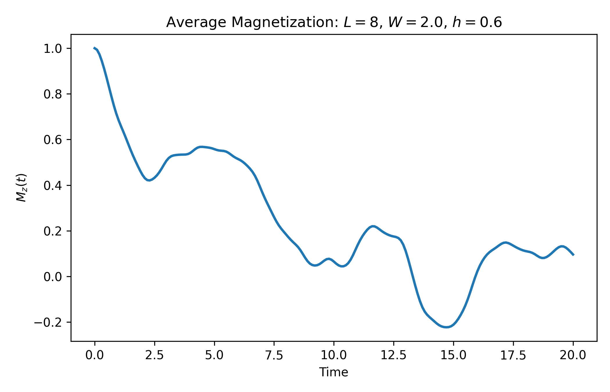
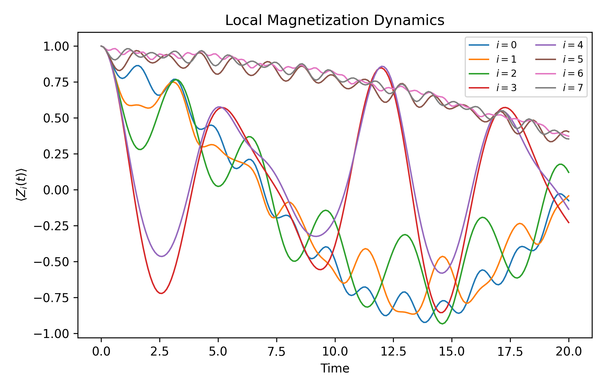

# Many-Body Spin-Chain Dynamics with QuSpin

This repository contains a compact example of quantum spin-chain dynamics using **QuSpin**. The project focuses on the time evolution of a disordered transverse-field Ising chain and the calculation of magnetization observables.

The goal is to provide a clean and reproducible scientific Python workflow for simulating many-body quantum dynamics in spin systems.

## Overview

We consider a one-dimensional spin-1/2 chain described by the Hamiltonian

```math
H =
\sum_{i=1}^{L-1} J_i Z_i Z_{i+1}
+
h \sum_{i=1}^{L} X_i,
```

where:

- $Z_i$ and $X_i$ are Pauli operators acting on site $i$;
- $J_i$ is a site-dependent nearest-neighbor Ising coupling;
- $h$ is the transverse-field strength;
- $L$ is the number of spins.

Disorder is introduced in the interaction strength as

```math
J_i = J + \delta J_i,
```

with

```math
\delta J_i \sim \mathcal{U}[-W, W],
```

where $W$ controls the disorder amplitude.

## Physical Motivation

The transverse-field Ising model is a paradigmatic model in quantum magnetism, quantum simulation, and non-equilibrium many-body physics.

In the clean case, the competition between the Ising interaction and the transverse field generates nontrivial quantum dynamics. In the disordered case, the system can display signatures of memory retention and slow relaxation, which are relevant for the study of localization phenomena in interacting quantum systems.

This repository is intended as a small portfolio project demonstrating:

- Hamiltonian construction with QuSpin;
- exact time evolution of quantum states;
- computation of local and total magnetization;
- analysis of disorder effects in spin-chain dynamics;
- reproducible scientific Python workflows.

## Observables

The main observable computed in this project is the average magnetization along the $z$ direction:

```math
M_z(t)
=
\frac{1}{L}
\sum_{i=1}^{L}
\langle Z_i(t) \rangle.
```

We also compute local magnetizations,

```math
\langle Z_i(t) \rangle,
```

which allow us to inspect site-resolved dynamics.

## Repository Structure

```text
many-body-spin-chain-dynamics-quspin/
├── README.md
├── requirements.txt
├── src/
│   ├── run_quspin_dynamics.py
│   └── plot_results.py
├── results/
│   └── .gitkeep
└── figures/
    └── .gitkeep
```

## Planned Workflow

1. Build the disordered transverse-field Ising Hamiltonian using QuSpin.
2. Prepare an initial product state.
3. Evolve the state in time.
4. Compute local and average magnetization.
5. Save numerical results.
6. Generate publication-style plots.

## Requirements

The main Python packages used in this project are:

```text
numpy
scipy
matplotlib
quspin
```

Install dependencies with:

```bash
pip install -r requirements.txt
```

## Running the Simulation

After the code is added, the main simulation can be run with:

```bash
python src/run_quspin_dynamics.py
```

The plotting script can then be run with:

```bash
python src/plot_results.py
```

## Expected Outputs

The project will generate:

- numerical data files in `results/`;
- magnetization plots in `figures/`;
- time-dependent curves of local and average magnetization.

## Example Results

The simulation generates time-dependent magnetization curves for a disordered transverse-field Ising chain.

### Average Magnetization



### Local Magnetization



## Status

This repository is under active development.

The first version focuses on a minimal exact-dynamics simulation of a disordered transverse-field Ising chain using QuSpin.

## Author

Thiago Rocha Girão Souza  
PhD Candidate in Physics  
Quantum Computing | Quantum Dynamics | Scientific Python
